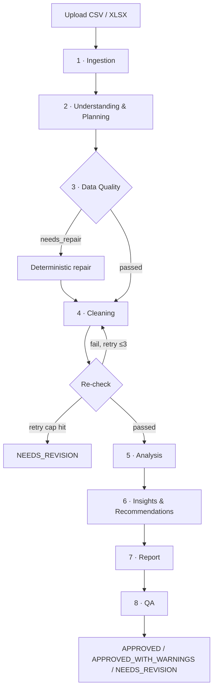

<p align="center">
  
  
</p>

<h1 align="center">Insight Forge</h1>
<p align="center"><b>An 8-agent CrewAI pipeline that turns a raw CSV/XLSX into an evidence-grounded, QA-verified analytics report.</b></p>

---

## Table of Contents

- [📚 Full Reference](#-full-reference)
  - [Agents in depth](#agents-in-depth)
  - [Full repository tree](#full-repository-tree)
  - [Full guardrails](#full-guardrails)
    - [Hard limits](#hard-limits)
    - [System-wide rules](#system-wide-rules)
  - [Schemas \& data contracts](#schemas--data-contracts)
  - [Configuration](#configuration)
  - [Reproducibility, caching \& retention](#reproducibility-caching--retention)
    - [Manifest, logging \& run isolation](#manifest-logging--run-isolation)
    - [Caching \& idempotency](#caching--idempotency)
    - [Run comparison \& retention policy](#run-comparison--retention-policy)
  - [Full testing reference](#full-testing-reference)

---

## What it does

A user uploads a spreadsheet. The pipeline validates it, figures out what kind of data it is, cleans it, computes every KPI and statistical test on the **full dataset**, generates charts, writes evidence-grounded insights, renders an HTML report, and — before calling it done — independently **recomputes every number to check its own work**. The output is either `APPROVED`, `APPROVED_WITH_WARNINGS`, or `NEEDS_REVISION`.

## Core principle

> **The LLM decides WHAT to do. Python does the work.**

No LLM ever touches raw data, computes a number, cleans a value, or draws a chart. It only chooses what to run and writes the narrative text. Every computation is deterministic Python (pandas/scipy), and a dedicated QA stage recomputes 100% of the numbers independently before approval.

## How it works



## The 8 agents, at a glance

| # | Agent | Type | One-line mission |
|---|---|---|---|
| 1 | **Ingestion** | Agent | Validate the file, extract data, ask business questions |
| 2 | **Understanding** | Agent | Classify columns, detect domain, build the analysis plan |
| 3 | **Data Quality** | Flow step (no LLM) | Deterministic pre-cleaning gate |
| 4 | **Cleaning** | Agent | Fix data per strategy; re-check quality |
| 5 | **Analysis** | Agent | Compute KPIs, run stats, plan & draw charts |
| 6 | **Insights** | Agent | Write evidence-grounded insights & recommendations |
| 7 | **Report** | Agent | Render the HTML report + executive summary |
| 8 | **QA** | Agent | Recompute everything; issue the final verdict |

Full mission/input/output/tasks/tools per agent → [Agents in depth](#agents-in-depth) below.

## Repository layout

```
insight-forge/
├── main.py                     # entry point — builds Crew, runs Flow (Task 11)
├── config.yaml                 # per-agent config, hard limits, retention
├── .env.example                # API keys sample (never committed)
├── pyproject.toml              # dependencies
├── crew/
│   ├── crew.py                 # CrewAI Agents + Tasks in order (Task 11)
│   └── flows.py                # DQ gate, Cleaning re-check, QA verdict branches (Task 11)
├── agents/                     # one module per pipeline stage, all 8 stages together
│   ├── ingestion_agent.py      # stage 1
│   ├── understanding_agent.py  # stage 2 — roles + domain + DSL plan
│   ├── data_quality.py         # stage 3 — Engine only, no LLM
│   ├── cleaning_agent.py       # stage 4
│   ├── analysis.py             # stage 5 — compute (5a) + charts rendering (5b)
│   ├── insight_agent.py        # stage 6
│   ├── report_agent.py         # stage 7
│   └── qa_agent.py             # stage 8
├── analysis/                   # pure computation, no LLM
│   ├── chart_planner.py        # 14-kind whitelist + 11-rule data-shape table
│   ├── chart_quality.py        # stage 5c per-chart quality gate + DQ confidence labels
│   ├── chart_renderer.py       # hand-rolled SVG renderers (navy/gold palette, labels, captions)
│   ├── dsl_executor.py         # whitelist DSL ops over ALL rows
│   ├── evidence.py             # evidence_id minting + registry (the only writer)
│   ├── report_builder.py       # Jinja2 report rendering + 9 section renderers + Chart.js init
│   ├── qa_recompute.py         # KPI recomputation from cleaned CSV + reference validation
│   ├── qa_verdict.py           # score formula + deterministic verdict table
│   ├── generic/                # descriptive · correlation · distribution · trend · comparison
│   └── domains/                # sales · finance · marketing · hr · operations (placeholder)
├── shared/
│   ├── core/                    # pure logic, no CrewAI — the unit-testable layer
│   │   ├── validation.py        # FileValidator (ext/MIME/signature/parse/rows)
│   │   ├── reader.py            # FileReader (discovery + extract_sheet, streamed)
│   │   ├── profiler.py          # DataProfiler (profile + samples, PII-redacted)
│   │   ├── pii.py               # PiiDetector (rule-based, no LLM)
│   │   ├── business_context.py  # BusinessContextGatherer (dialog + generic mode)
│   │   ├── understanding.py     # role rules §2.2 + domain facts + DSL plan builder
│   │   ├── data_quality.py      # §2.3 checks + deterministic repair
│   │   ├── cleaning.py          # §2.4 strategy table + execution
│   │   ├── contracts.py         # column contracts + normalization layer (currency/percent/dates/units)
│   │   ├── deep_profile.py      # sentinel-aware missingness + MAD outliers + impact analysis
│   │   ├── lineage.py           # raw→validated→repaired→cleaned→analysis_ready chain
│   │   └── io_utils.py          # large-data I/O (Parquet cache + chunked stats)
│   ├── tools/                   # CrewAI @tool wrappers, aggregated in __init__.py
│   │   ├── file_io.py           # file_validator · file_reader · file_sheet_extract
│   │   ├── profiling.py         # pii_detector · data_profiler
│   │   ├── human.py             # human_input
│   │   ├── understanding.py     # column_profiler · domain_classifier · dsl_plan_builder
│   │   ├── data_quality.py      # 6+1 stage-3 check tools
│   │   ├── cleaning.py          # 7 stage-4 tools
│   │   ├── analysis.py          # 5 stage-5 tools
│   │   ├── report.py            # 4 stage-7 tools
│   │   └── qa.py                # 3 stage-8 tools
│   ├── schemas.py               # Pydantic models for every artifact
│   ├── dsl_validator.py         # DSL whitelist
│   ├── llm.py                   # single build_llm(cfg, agent_name) factory
│   ├── logger.py                # structured per-stage logs → runs/<run_id>/logs/
│   └── utils.py                 # config load, run_id allocator
├── resources/
│   ├── report_template.html     # redesigned Jinja2 template: masthead, EN/AR + RTL, light/dark, TOC, KPI count-up, interactive Chart.js + SVG fallback, downloadCSV
│   └── business_context/        # static business-context templates
├── runs/                        # run isolation — per-run output (gitignored)
│   └── <run_id>/                # data/ · knowledge/ · metadata/ · outputs/ · logs/ · report.html
├── cache/                       # key→run_id index (idempotency)
└── tests/
    ├── unit/                    # 674 tests passing (unit + security, no LLM)
    └── fixtures/                # test templates (report_minimal.html, etc.)
```

Fully annotated tree → [Full repository tree](#full-repository-tree) below.

## Key technologies

| Concern | Stack |
|---|---|
| Orchestration | CrewAI (Agents, Tasks, Flows) |
| Data | pandas, numpy, openpyxl |
| Stats | scipy |
| Charts | hand-rolled SVG renderers + Chart.js (interactive canvases in the report) |
| Reporting | jinja2 (autoescape), Bootstrap 5 (report theme) |
| Validation | Pydantic |

## Guardrails

Hard limits prevent unbounded loops and runaway cost: max 3 retries per LLM task, max 3 cleaning re-checks, per-run cost/token/time caps, 200 MB file size cap, chunked processing above 5M rows, and a 20-chart cap. Any tripped limit stops the run cleanly and auto-issues `NEEDS_REVISION`.

Full guardrails, fallback semantics, and the deterministic QA verdict table → [Full guardrails](#full-guardrails) below.

## Installation & usage

```bash
git clone <repository-url>
cd insight-forge
pip install -e .
cp .env.example .env      # fill in LLM provider keys
python main.py
```

## Testing

**674 tests passing (1 skipped)** in `tests/unit/` + `tests/security/` — runs with **no LLM and no pipeline workflow** (`pytest tests/unit tests/security`). Full suite: **742 passed, 1 skipped** including e2e golden runs on `sales_*` fixtures. Suites: unit, integration, statistical, agent, security, and end-to-end runs against golden datasets with precomputed ground truth (`sales_small`, `sales_missing`, `sales_outliers`, `sales_duplicates`, `sales_injection`, `sales_pii`, `hr`, `finance`).

Full test suite breakdown → [Full testing reference](#full-testing-reference) below.

## Status & roadmap

**Production-oriented, not production-ready.** All 8 pipeline stages are implemented and E2E verified on real data. Recent additions: column contracts + normalization layer, deep profiling (sentinel-aware missingness, MAD outliers, impact), full data lineage, large-data Parquet cache + chunked stats, a per-chart quality gate (5c), pareto/waterfall chart kinds, and a redesigned report template with EN/AR + RTL, light/dark themes, and interactive Chart.js charts. Roadmap: golden-dataset evaluation suite → domain KPI modules → observability/cost dashboard → forecasting & anomaly detection.

---

# 📚 Full Reference

Everything below is the same design spec, in full detail. Click any section to expand.

## Agents in depth

Each agent follows: **Mission → Input → Output → Tasks → Tools**.

<details>
<summary><b>1. Ingestion</b> — <code>agents/ingestion_agent.py</code></summary>

**Mission:** validate the file deeply, extract data, ask business questions, emit profile + context.

| Who | Does |
|---|---|
| Python | validate (extension + MIME + signature + parser), read CSV/XLSX, merge sheets, profile (shape/dtypes/nulls/duplicates), detect PII columns |
| LLM | ask which sheet + business questions (HumanInputTool), interpret answers |

**Input:** raw file, user answers
**Output:** `data/extracted/*.csv`, `metadata/data_profile.json`, `knowledge/business_context.json`

**Tasks:** `validate_and_extract` · `profile_dataset` · `gather_business_context`
**Tools:** `file_validator_tool` · `file_reader_tool` · `data_profiler_tool` · `pii_detector_tool` · `human_input_tool`

**Notes:** stops on unsupported format / empty or <5 rows / user cancel / fail after 3 retries. Cell content = untrusted data. Question timeout 5 min → Generic Analysis Mode.

**Data profile output shape:**
```json
{
  "file_name": "sales.xlsx", "file_hash": "sha256:...",
  "row_count": 2300, "column_count": 8,
  "columns": ["date","product","category","revenue","quantity","city"],
  "column_types": {"date": "datetime64", "revenue": "float64"},
  "missing_values": {"city": 45}, "duplicate_rows": 12,
  "pii_columns": ["customer_email"], "validation_status": "passed"
}
```
</details>

<details>
<summary><b>2. Understanding</b> (+ Planning) — <code>agents/understanding_agent.py</code></summary>

**Mission:** from profile + a 20-row sample, classify column roles, detect domain, propose a DSL analysis plan. Planning is this agent's **second Task**, not a separate agent.

| Who | Does |
|---|---|
| Python | `nunique()`, `head()`, datetime/numeric detection, role rules |
| LLM | review roles, detect domain/entities, propose DSL KPIs, build plan |

**Column-role rules (Python):**
```
nunique == row_count          → identifier
dtype datetime                → temporal
numeric & nunique > 20        → measure
numeric & nunique ≤ 20        → measure or categorical
object & nunique ≤ 20         → dimension
object & nunique > 50         → free_text
```
LLM may reclassify by name (e.g. numeric `zip_code` → identifier).

**Input:** `data_profile.json`, `business_context.json`, 20-row sample
**Output:** `metadata/dataset_understanding.json`, `metadata/analysis_plan.json` (DSL ops only)

**Tasks:** `classify_column_roles` · `detect_domain_and_entities` · `build_analysis_plan`
**Tools:** `column_profiler_tool` · `domain_classifier_tool` · `dsl_plan_builder_tool` (validates against `shared/dsl_validator.py` whitelist)

**Output shape:**
```json
{
  "detected_domain": "sales", "domain_confidence": 0.87,
  "entities": ["Product","Customer","Order"],
  "temporal_columns": ["order_date"], "dimensions": ["product","category"],
  "measures": ["revenue","quantity"], "identifiers": ["order_id"],
  "candidate_kpis": [
    {"kpi_id":"KPI-001","name":"Total Revenue","operation":{"function":"sum","column":"revenue"}}
  ],
  "statistical_tests":["descriptive","correlation","trend","anova"],
  "has_temporal_data": true, "limitations": []
}
```
</details>

<details>
<summary><b>3. Data Quality</b> — <code>agents/data_quality.py</code> (deterministic Flow step, no LLM)</summary>

**Mission:** deterministic pre-cleaning gate — catches what cleaning strategy can't see.

**Checks:** schema · invalid values (impossible dates, negative revenue, %>100, `age=350`) · missingness MCAR/MAR/MNAR · duplicates · referential integrity · business rules · units/encoding.

**Input:** `dataset_understanding.json`, `data_profile.json`, `business_context.json`, raw sample
**Output:** `metadata/data_quality_report.json` (`status: passed | needs_repair`)

**Gate:** `passed` → Cleaning. `needs_repair` → Repair, then Cleaning. Unresolved high-severity → QA must flag.

**Repair scope (auto-fix vs flag to Cleaning):**

| Issue | Auto-fix | Flagged to Cleaning |
|---|---|---|
| Negative values in measure | No — never sign-flip; flagged | Cleaning decides (drop/exclude) |
| Type mismatch | Cast by role (`astype`, `to_datetime`) | — |
| Exact duplicates | `drop_duplicates()` | — |
| Impossible dates | Row dropped + logged | — |
| Out-of-range percentages | Flagged | Cleaning decides |
| Unknown category values | Flagged | Cleaning decides (map/keep/"Unknown") |
| MAR/MNAR missingness | No imputation — preserve + flag | Cleaning builds flag features |

Rule: **Repair never invents data.** It only casts types, drops exact duplicates/impossible rows, and preserves everything else for Cleaning to decide.

**Output shape:**
```json
{
  "status": "passed | needs_repair",
  "invalid": {"revenue": ["negative"], "order_date": ["future_dates"]},
  "missingness": {"rate": 0.27, "pattern": "non_random", "assessment": "MAR_suspected"},
  "duplicates": 12,
  "issues": [{"severity":"high","category":"invalid_value"}]
}
```

**Tools:** `schema_checker_tool` · `invalid_value_checker_tool` · `missingness_analyzer_tool` · `duplicate_detector_tool` · `referential_integrity_tool` · `deterministic_repair_tool`
</details>

<details>
<summary><b>4. Cleaning</b> — <code>agents/cleaning_agent.py</code></summary>

**Mission:** clean by column role + DQ report. LLM picks strategy; Python executes, logs, and re-checks.

| Who | Does |
|---|---|
| LLM | decide strategy (JSON) |
| Python | fillna, `*_missing_flag` columns, cast types, drop dupes, IQR outliers, log + re-run DQ checks |

**Missing-value strategy by role + missingness type:**

| Role | MCAR <5% | MCAR 5-30% | MAR/MNAR (signal) | >70% |
|---|---|---|---|---|
| measure | median fill | median + flag | flag_and_preserve + exclude | drop |
| dimension | mode fill | "Unknown" | flag_and_preserve | keep + flag |
| temporal | drop row | drop row | drop row | drop column |
| identifier | drop row | drop row | drop row | drop column |

> `flag_and_preserve` = keep missingness as a boolean feature. Never impute silently when the pattern is non-random.

**Input:** DQ report, understanding, profile, raw data
**Output:** `data/processed/cleaned_data.csv` (latest accepted attempt; retries kept as `cleaned_data_attempt_<n>.csv`), `metadata/cleaning_result.json`

**Tasks:** `decide_cleaning_strategy` · `execute_cleaning` · `recheck_data_quality` (loops on FAIL, max 3 re-runs)
**Tools:** `cleaning_strategy_tool` · `fillna_tool` · `flag_column_tool` · `type_caster_tool` · `dedup_tool` · `iqr_outlier_tool` · `dq_recheck_tool`
</details>

<details>
<summary><b>5. Analysis</b> — <code>agents/analysis.py</code></summary>

**Mission:** compute everything on the full cleaned dataset. LLM selects KPIs and re-ranks chart candidates; Python executes DSL, runs stats, plans & draws charts, writes evidence, and quality-gates every chart (5c).

**Statistical suite:**

| Category | Tests |
|---|---|
| Descriptive | mean/median/std/quantiles/IQR/skew/kurtosis |
| Correlation | Pearson (+ p-value, CI, effect size, n); Spearman |
| Comparison 2 groups | t-test, Mann-Whitney U |
| Comparison 3+ groups | ANOVA, Kruskal-Wallis + post-hoc |
| Categorical | Chi-square, Cramér's V |
| Time series | YoY, MoM, WoW, rolling, seasonality, trend significance |

**KPI DSL whitelist** (LLM never writes freeform formulas):
```
sum, mean, median, count, nunique, min, max, std, growth, correlation, ratio
```

| Function | Parameters |
|---|---|
| `sum, mean, median, min, max, std, count, nunique` | `column` · `group_by` (opt) · `filter` (opt) |
| `correlation` | `column_a`, `column_b` · `method`: pearson\|spearman |
| `ratio` | `numerator`, `denominator` (each a nested op) |
| `growth` | `column` · `over_column` · `period`: YoY\|MoM\|WoW · `basis` · `as_percent` |

**KPI record example:**
```json
{
  "kpi_id": "KPI-001", "name": "Total Revenue",
  "operation": {"function": "sum", "column": "revenue", "group_by": null, "filter": null},
  "value": 2450000.50, "evidence_id": "EV-001", "computed_by": "pandas"
}
```

**Growth KPI example** (`growth` semantic: `(current − baseline) / baseline`):
```json
{
  "kpi_id": "KPI-003", "name": "Revenue MoM Growth",
  "operation": {
    "function": "growth", "column": "revenue", "over_column": "order_date",
    "period": "MoM", "basis": "previous_period", "group_by": ["category"],
    "filter": null, "as_percent": 1
  },
  "value": 12.4, "evidence_id": "EV-003", "computed_by": "pandas"
}
```

**Chart planner (data-driven, not a fixed menu)** — Python inspects each candidate's data shape and picks the chart form from an ordered rule table (`analysis/chart_planner.py`); the LLM only chooses which facts deserve a chart:

| # | Data shape | Chart |
|---|---|---|
| 1 | single dimension, ≤2 values | bar / donut |
| 2 | ordered axis (dates), ≥3 points | line |
| 3 | single dimension, 3–12 values | vertical bar |
| 4 | single dimension, 13–50 values | horizontal bar |
| 5 | single dimension, >50 values | barh top-15 + "$rest" rollup |
| 6 | numeric distribution/skew | histogram (Freedman–Diaconis bins) |
| 7 | 2 numeric measures | scatter + trend line if r significant |
| 8 | ≥3 numeric measures | ranked correlation heatmap |
| 9 | share/"% of whole" ≈100% | doughnut |
| 10 | ranked sum/count contribution, 3–15 values | pareto (sorted bars + cumulative % + 80/20 line) |
| 11 | growth KPI over time (≥3 periods) | line + waterfall of period contributions |

**14-kind whitelist:** `bar · barh · line · doughnut · histogram · scatter · heatmap · area · boxplot · stacked_bar · pie · lollipop · pareto · waterfall`. The last seven exist only via LLM proposal or explicit plan intent; Python validates every proposal and falls back to the rule table when rejected.

If data is too thin, planner downgrades to a simple bar/table and stamps `reliability: "low_n"`.

**Chart record example:**
```json
{
  "chart_id": "CH-004", "kind": "line",
  "reason": "1 ordered dim (month) >= 3 points -> line",
  "columns": ["order_date", "revenue"], "evidence_id": "EV-007", "computed_by": "pandas"
}
```

**Quality gate (stage 5c):** `analysis/chart_quality.py` checks every chart before it reaches the report — SVG integrity, rendered group totals must match the KPI value within 0.1%, and a DQ-based confidence label (missingness/repair/contract violations/outliers) → `metadata/chart_quality.json`.

**Accessibility:** navy/gold palette with value labels on bars/points (never color-only), line markers, alt-text captions per chart (title + reliability + evidence_id).
**Localization:** numeric/date formatting follows report locale (hand-rolled, no babel); the report template ships full EN/AR translations with RTL layout and a light/dark theme toggle.

**Input:** cleaned data, plan, understanding, business context, cleaning result
**Output:** `outputs/kpis.json`, `outputs/statistical_results.json`, `outputs/charts/*.svg`, `metadata/chart_metadata.json`, `outputs/evidence_registry.json`

**Tasks:** `select_kpis` · `run_dsl_and_stats` · `rank_chart_candidates`
**Tools:** `dsl_executor_tool` · `statistical_suite_tool` · `chart_planner_tool` · `chart_renderer_tool` · `evidence_registry_tool` (the only writer)
</details>

<details>
<summary><b>6. Insights & Recommendations</b> — <code>agents/insight_agent.py</code></summary>

**Mission:** write evidence-grounded insights + hedged recommendations.

**Claim taxonomy:**

| Type | Allowed when | Guard |
|---|---|---|
| DESCRIPTIVE / COMPARATIVE | always | must quote evidence IDs |
| CORRELATIONAL | p-value + CI present | report strength, not cause |
| PREDICTIVE | forecasting module ran | labeled as forecast |
| CAUSAL | never without causal methodology | e.g. "revenue grew during discount periods," not "discounts caused growth" |

**Recommendation chain:** Observation → Finding → Implication → hedged recommendation ("consider testing…").

**Validation before saving:** non-empty evidence_ids, refs exist in registry, claim matches evidence type, recommendations reference only existing insights. Any failure → removed + logged.

**Insight record example:**
```json
{
  "insight_id": "INS-001", "claim_type": "COMPARATIVE",
  "title": "electronics fastest in Q3", "confidence": "high",
  "evidence_ids": ["EV-001", "EV-006"],
  "required_evidence": ["group_comparison", "growth_rate"],
  "related_kpis": ["KPI-001"]
}
```

**Evidence lineage example** (raw → cleaning → filter → aggregation → value):
```json
{
  "evidence_id": "EV-006",
  "source": {
    "file_hash": "…", "sheet": "Sales",
    "transformations": ["removed_duplicates"],
    "filter": "category==Electronics",
    "aggregation": "monthly_sum", "comparison": "Q4 vs Q3", "result": 27.4
  }
}
```

**Input:** `kpis.json`, `statistical_results.json`, `evidence_registry.json`, `business_context.json`, `dataset_understanding.json`
**Output:** `outputs/insights.json`

**Tasks:** `generate_insights` · `build_recommendations` · `validate_claims`
**Tools:** `evidence_lookup_tool` · `claim_validator_tool` · `human_input_tool`

**Optional human review checkpoint** (`config.yaml: review_required: true`): after validation, a human analyst can approve, edit text (evidence_ids must stay intact), or request regeneration.
</details>

<details>
<summary><b>7. Report</b> — <code>agents/report_agent.py</code></summary>

**Mission:** Python renders the full HTML report; LLM writes only the 3–5 sentence executive summary.

**Security in render:** Jinja `autoescape=True`, HTML sanitizer, CSP header — cell content never rendered raw.

**Report design:** `resources/report_template.html` is a product-grade Jinja2 template — masthead (title/subtitle/prepared-for/date), sticky navbar with **language toggle (EN/AR, full RTL)** and **theme toggle (light/dark)**, numbered table of contents, KPI cards with count-up on view, **interactive Chart.js canvases** (navy/gold palette) with static SVG fallback and per-chart drill-down, `downloadCSV` export of every table, signature + footer, back-to-top. The embedded chart init is idempotent (`__REPORT_CHART_INSTANCES__` + `__rebuildReportCharts`) so language/theme switches re-render charts without breaking the page.

**Input:** all `outputs/`, `metadata/`, `knowledge/` files, `resources/report_template.html`
**Output:** `report.html`, `metadata/report_result.json`

**Tasks:** `render_report` · `write_executive_summary`
**Tools:** `html_renderer_tool` · `html_sanitizer_tool` · `locale_formatter_tool` · `chart_embed_tool`
</details>

<details>
<summary><b>8. QA</b> — <code>agents/qa_agent.py</code></summary>

**Mission:** last gate. Python recomputation is authoritative; an independent LLM (different model/prompt) checks logic and readability.

| Who | Checks |
|---|---|
| Python | recompute 100% of KPIs (0.01% tolerance) · refs valid · charts exist · HTML sections · manifest fallback |
| LLM | insight/recommendation logic alignment, summary readability |

**Score (informational only):** `100 – (critical×15) – (warnings×2.5) – (info×0.5)`, floor 0. The verdict is **not** decided by score — a high score never overrides `NEEDS_REVISION` when a critical issue exists.

**Verdict (deterministic):**

| Condition | Verdict |
|---|---|
| any critical | NEEDS_REVISION |
| fallback used | NEEDS_REVISION |
| invalid evidence / unresolved DQ | NEEDS_REVISION |
| resource limit exceeded | NEEDS_REVISION (auto) |
| minor warnings only | APPROVED_WITH_WARNINGS |
| clean | APPROVED |

**Output:** `metadata/qa_verdict.json`

**Tasks:** `recompute_kpis` · `validate_structure` · `review_logic_and_readability` · `compute_verdict`
**Tools:** `kpi_recomputation_tool` · `reference_validator_tool` · `score_calculator_tool` · `verdict_tool`
</details>

## Full repository tree

<details>
<summary>Click to expand the fully annotated file tree</summary>

```
insight-forge/
├── main.py                     # entry — builds Crew, runs Flow
├── config.yaml                 # per-agent role/goal/backstory/model, hard limits, retention, review_required
├── .env.example                # API keys (loaded via shared/utils.py, never committed)
├── pyproject.toml              # crewai + pandas, numpy, scipy, openpyxl, jinja2, pyyaml, python-dotenv
├── crew/
│   ├── crew.py                 # CrewAI Agents + Tasks in order
│   └── flows.py                # DQ gate, Cleaning re-check, QA verdict branches
├── agents/                     # one module per pipeline stage, all 8 stages together
│   ├── ingestion_agent.py
│   ├── understanding_agent.py  # roles + domain + DSL plan (planning is 2nd Task, not a separate file)
│   ├── data_quality.py         # Engine only, no LLM — invoked by flows.py
│   ├── cleaning_agent.py
│   ├── analysis.py             # compute (5a) + charts rendering (5b) in ONE agent
│   ├── insight_agent.py
│   ├── report_agent.py
│   └── qa_agent.py
├── analysis/                   # pure computation, no LLM
│   ├── chart_planner.py        # data-shape rule table (11 rules) → chart kind + reason
│   ├── chart_quality.py        # stage 5c quality gate + DQ confidence labels
│   ├── chart_renderer.py       # hand-rolled SVG renderers (14 kinds, navy/gold palette)
│   ├── dsl_executor.py         # whitelist DSL ops over ALL rows
│   ├── evidence.py             # evidence_id minting + evidence_registry.json (the only writer)
│   ├── report_builder.py       # Jinja2 report rendering + 9 section renderers + Chart.js init
│   ├── qa_recompute.py         # KPI recomputation + reference validation
│   ├── qa_verdict.py           # score formula + deterministic verdict
│   ├── generic/                # descriptive, correlation, distribution, trend, comparison
│   └── domains/                # sales, finance, marketing, hr, operations (placeholder)
├── shared/
│   ├── core/                    # pure logic, no CrewAI — the unit-testable layer
│   │   ├── validation.py        # FileValidator (ext/MIME/signature/parse/rows)
│   │   ├── reader.py            # FileReader (discovery + extract_sheet, streamed)
│   │   ├── profiler.py          # DataProfiler (profile + samples, PII-redacted)
│   │   ├── pii.py               # PiiDetector (rule-based, no LLM)
│   │   ├── business_context.py  # BusinessContextGatherer (dialog + generic mode)
│   │   ├── understanding.py     # role rules §2.2 + domain facts + DSL plan builder
│   │   ├── data_quality.py      # §2.3 checks + deterministic repair
│   │   ├── cleaning.py          # §2.4 strategy table + execution
│   │   ├── contracts.py         # column contracts + normalization layer
│   │   ├── deep_profile.py      # sentinel-aware missingness + MAD outliers + impact
│   │   ├── lineage.py           # raw→validated→repaired→cleaned→analysis_ready chain
│   │   └── io_utils.py          # large-data I/O (Parquet cache + chunked stats)
│   ├── tools/                   # CrewAI @tool wrappers, aggregated in __init__.py
│   │   ├── file_io.py           # file_validator · file_reader · file_sheet_extract
│   │   ├── profiling.py         # pii_detector · data_profiler
│   │   ├── human.py             # human_input
│   │   ├── understanding.py     # column_profiler · domain_classifier · dsl_plan_builder
│   │   ├── data_quality.py      # 6+1 stage-3 check tools
│   │   ├── cleaning.py          # 7 stage-4 tools
│   │   ├── analysis.py          # 5 stage-5 tools
│   │   ├── report.py            # 4 stage-7 tools
│   │   └── qa.py                # 3 stage-8 tools
│   ├── schemas.py               # Pydantic models for every artifact
│   ├── dsl_validator.py         # DSL whitelist — used by Understanding (build) and Analysis (execute)
│   ├── llm.py                   # single build_llm(cfg, agent_name) factory
│   ├── logger.py                # structured per-stage log → runs/<run_id>/logs/
│   └── utils.py                 # config load, run_id allocator
├── resources/                  # read-only static assets
│   ├── report_template.html
│   └── business_context/       # static business-context templates
├── runs/                       # run isolation — the only writable surface per run
│   └── <run_id>/
│       ├── data/                # raw/ extracted/ processed/ (validated_data · cleaned_data · analysis_ready)
│       ├── knowledge/           # business_context.json (per-run)
│       ├── metadata/            # data_profile · understanding · analysis_plan · dq_report · data_contracts · contract_violations · deep_profile · lineage · cleaning_result · impact_cleaning · chart_metadata · chart_quality · report_result · qa_verdict
│       ├── outputs/             # kpis.json · statistical_results.json · insights.json · evidence_registry.json · charts/
│       ├── report.html          # final rendered report
│       ├── logs/                # LLM/tool logs
│       └── master_manifest.json
├── cache/                       # key→run_id index (idempotency)
└── tests/                       # unit/ · e2e/ · integration/ · golden/ · security/ · fixtures/
```

</details>

## Full guardrails

<details>
<summary>Click to expand hard limits, fallback semantics, and system-wide rules</summary>

### Hard limits

| Limit | Value |
|---|---|
| LLM retries per agent task | 3 |
| Post-cleaning DQ re-checks | 3 → auto-verdict NEEDS_REVISION (`cleaning_retry_limit_exceeded`) |
| HumanInputTool timeout | 5 min → Generic Analysis Mode |
| Max file size | 200 MB (reject above) |
| Max rows | 5,000,000 (above → chunked processing, not rejection) |
| Max columns | 10,000 |
| Max chart count | 20 (excess dropped, lowest-ranked first; `charts_truncated: true`) |
| Per-stage timeout | 600s default (`config.yaml`) |
| Per-run LLM cost cap | `max_cost_usd` (default 5.00) |
| Per-agent token cap | `max_tokens_per_agent` (default 50k in/out) |
| Total run duration | `max_run_seconds` (default 1800) |

**Fallback semantics:** any tripped cap stops the run cleanly, writes partial output, and QA emits auto-verdict `NEEDS_REVISION` with a machine-readable reason (`cleaning_retry_limit_exceeded`, `cost_limit_exceeded`, `token_limit_exceeded`, `run_time_limit_exceeded`).

**>5M rows:** parsed via chunking (`pandas.read_csv(chunksize=50_000)`, `openpyxl.read_only`); aggregations stream chunk-by-chunk so final numbers stay full-data, never sampled.

### System-wide rules

- **Full data, always** — Python aggregates the complete dataset; LLM/UX see samples only.
- **Python is authoritative** — QA recomputes 100% of KPIs from cleaned data (0.01% tolerance).
- **Evidence is concrete** — every number/chart/insight/claim carries an `evidence_id` with lineage.
- **Claims are conservative** — descriptive/comparative/correlational by default; predictive/causal gated.
- **Generic Analysis Mode** — if business questions time out, proceeds with `context_confidence: 0`.

</details>

## Schemas & data contracts

<details>
<summary>Click to expand the JSON contracts referenced above (Pydantic models, planned in <code>shared/schemas.py</code>)</summary>

**Data profile (Ingestion output):**
```json
{
  "file_name": "sales.xlsx", "file_hash": "sha256:...",
  "row_count": 2300, "column_count": 8,
  "columns": ["date","product","category","revenue","quantity","city"],
  "column_types": {"date": "datetime64", "revenue": "float64"},
  "missing_values": {"city": 45}, "duplicate_rows": 12,
  "pii_columns": ["customer_email"], "validation_status": "passed"
}
```

**Dataset understanding / analysis plan:**
```json
{
  "detected_domain": "sales", "domain_confidence": 0.87,
  "entities": ["Product","Customer","Order"],
  "temporal_columns": ["order_date"], "dimensions": ["product","category"],
  "measures": ["revenue","quantity"], "identifiers": ["order_id"],
  "candidate_kpis": [
    {"kpi_id":"KPI-001","name":"Total Revenue","operation":{"function":"sum","column":"revenue"}}
  ],
  "statistical_tests":["descriptive","correlation","trend","anova"],
  "has_temporal_data": true, "limitations": []
}
```

**Data quality report:**
```json
{
  "status": "passed | needs_repair",
  "invalid": {"revenue": ["negative"], "order_date": ["future_dates"]},
  "missingness": {"rate": 0.27, "pattern": "non_random", "assessment": "MAR_suspected"},
  "duplicates": 12,
  "issues": [{"severity":"high","category":"invalid_value"}]
}
```

**KPI record:**
```json
{
  "kpi_id": "KPI-001", "name": "Total Revenue",
  "operation": {"function": "sum", "column": "revenue", "group_by": null, "filter": null},
  "value": 2450000.50, "evidence_id": "EV-001", "computed_by": "pandas"
}
```

**Evidence lineage:**
```json
{
  "evidence_id": "EV-006",
  "source": {
    "file_hash": "…", "sheet": "Sales",
    "transformations": ["removed_duplicates"],
    "filter": "category==Electronics",
    "aggregation": "monthly_sum", "comparison": "Q4 vs Q3", "result": 27.4
  }
}
```

**Insight record:**
```json
{
  "insight_id": "INS-001", "claim_type": "COMPARATIVE",
  "title": "electronics fastest in Q3", "confidence": "high",
  "evidence_ids": ["EV-001", "EV-006"],
  "related_kpis": ["KPI-001"]
}
```

**Chart record:**
```json
{
  "chart_id": "CH-004", "kind": "line",
  "reason": "1 ordered dim (month) >= 3 points -> line",
  "columns": ["order_date", "revenue"], "evidence_id": "EV-007", "computed_by": "pandas"
}
```

</details>

## Configuration

<details>
<summary>Click to expand <code>config.yaml</code> / <code>.env.example</code> details</summary>

A single root `config.yaml` holds:
- Per-agent `role` / `goal` / `backstory` / model selection (QA must differ from generation agents)
- Hard limits (retries, timeouts, cost caps, token caps, run duration)
- `review_required` — toggles the optional human review checkpoint after Insights
- `retention` — per-category retention days
- `max_cost_usd`, `max_tokens_per_agent`, `max_run_seconds`
- `encrypt_at_rest` — AES-256 encryption toggle for `runs/` data

`.env.example` is specified to hold LLM provider API keys, loaded via `shared/utils.py`, never committed. The spec does not enumerate exact variable names.

**HTTP API / web UI (new in v4.7):**

| Env var | Purpose |
|---|---|
| `INSIGHT_FORGE_API_KEY` | When set, the web app requires `X-API-Key` on every `POST /api/start` / `POST /api/demo` call (401 otherwise); `/api/state` exposes `auth_required` so the UI can show the key field |
| `INSIGHT_FORGE_ENC_KEY` | Base64 Fernet key for `encrypt_at_rest` (`retention` section); when unset the app auto-generates and persists `.enc_key` (git-ignored) |

**Queueing:** uploads run on a single background worker (FIFO). While a job is running, new requests are queued — `/api/state` reports `queued` count and the UI shows it. No job is ever dropped.

**Security headers (v4.7):** every HTML response carries `Content-Security-Policy: default-src 'self'` (inline script/style allowed, no external origins), `X-Content-Type-Options: nosniff`, and `X-Frame-Options: DENY`.

</details>

## Reproducibility, caching & retention

<details>
<summary>Click to expand manifest, caching/idempotency, run comparison, and retention policy</summary>

### Manifest, logging & run isolation

- **Manifest** (`master_manifest.json`) — everything needed to reproduce a run: `pipeline_version`, `code git_sha`, `data_hash`, `model`, `temperature`, `seed`, `python_version`, `packages`, `analysis_mode`.
- **Structured log per stage** — LLM latency/tokens/cost, tool calls, errors, retries.
- Each run gets a unique `run_id` (`run_<timestamp>_<seq>`) and writes only to its own `runs/<run_id>/` — no shared state between runs, safe to parallelize.
- Only the output root needs a lightweight `run_id` allocator (atomic `mkdir`); reads of `resources/` are read-only and safe concurrently.

### Caching & idempotency

- **Cache key** = `sha256(file_bytes)` + `config_version` + `prompt_version` + model ids, stored in `cache/` (key → run_id; `source_name` → run_ids).
- **Full-file hit:** same `input_hash` + effective config already produced an `APPROVED` run → return that run's report directly (`cached: true`), no recompute.
- **Partial hits**, keyed on what actually changed (not a blanket "context differs" rule):
  - Ingestion — always reusable on `input_hash` hit; never reads business context.
  - Data Quality's schema/type/duplicate checks — reusable; business-rules checks re-run if `business_context.json` changes.
  - Understanding/plan — re-run whenever business context changes.
  - Cleaning, Analysis — reusable **only if `analysis_plan.json` is byte-identical** to the cached run's plan (checked via plan hash, not "context changed y/n").
  - Insights, Summary — always re-run when upstream KPIs/evidence differ, or on `review_required` regeneration.
- Idempotency: same key + inputs → same outputs (deterministic stages deterministic; LLM stages reproducible via `temperature: 0` + `seed`).
- Cache is never QA's source of truth — QA always recomputes from current files.

### Run comparison & retention policy

**Run comparison:** emitted as `outputs/run_comparison.json` whenever a prior run shares `source_name`. Compares KPI-by-KPI (`{kpi_id, previous_value, current_value, abs_delta, pct_delta}`), plus row-count/date-range/QA-score deltas. Informational only — never affects the verdict.

**Retention:**

| Item | Default |
|---|---|
| Raw uploads | 7 days |
| Run artifacts | 30 days |
| Logs | 90 days |
| PII columns | redacted from LLM context/logs; full PII in outputs only with consent |
| At-rest encryption | AES-256 when `config.encrypt_at_rest: true` |
| User deletion | removes run dir + logs + cache entry immediately |
| Purging | daily janitor job |

</details>

## Full testing reference

<details>
<summary>Click to expand test suites and golden dataset table</summary>

**Test suites** (`tests/`):

| Suite | Covers |
|---|---|
| unit / integration | tools, DSL, handoffs |
| statistical | p-values / CI / effect-size vs known |
| agent | LLM JSON validity, plan viability |
| security | injection, XSS, malformed files |
| e2e on golden datasets | full pipeline matches ground truth |

**Golden datasets** (`tests/golden/fixtures/`):

| Fixture | Base data | What it tests | Expected |
|---|---|---|---|
| `sales_small` | clean, no issues | baseline correctness | revenue=10,000 · orders=100 · AOV=100 |
| `sales_missing` | + injected MCAR/MAR gaps | missingness + cleaning strategy | totals match `sales_small` after flag/impute |
| `sales_outliers` | + injected extreme values | IQR outlier handling | totals differ from `sales_small` (excluded, not zeroed) |
| `sales_duplicates` | + exact duplicate rows | dedup | totals collapse to `sales_small` after dedup |
| `sales_injection` | + SQL/script strings in cells | security (untrusted cell content) | neutralized, no code exec, no unescaped HTML |
| `sales_pii` | + email/phone columns | PII detection + redaction | `pii_columns` populated; PII absent from LLM/logs |
| `hr` | independent domain | domain detection + HR KPIs | `detected_domain: "hr"` |
| `finance` | independent domain | domain detection + finance KPIs | `detected_domain: "finance"` |

**Safety requirement:** poisoned cases (wrong numbers / missing evidence) → QA must never approve (false-approval rate = 0).

</details>

---

*Generated from `Insight Forge — Implementation Guide` v4.8.0.*