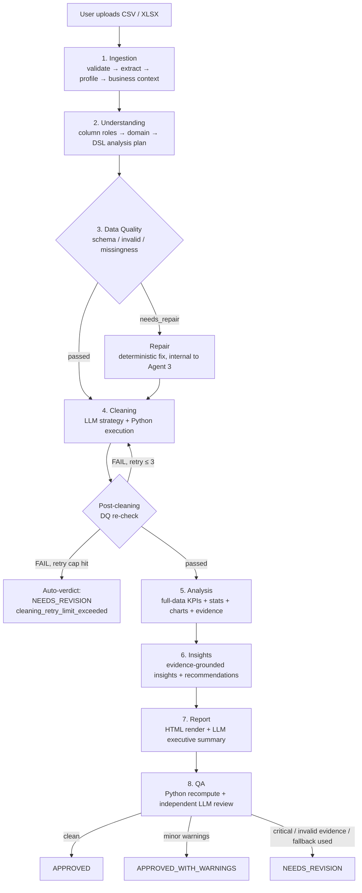

# Insight Forge

> ⚠️ **Status: Design Specification — no source code in this repository yet.**
> This README is generated entirely from `Insight Forge — Implementation Guide` (v4.3.0), the project's technical design document. **No `main.py`, agents, tools, schemas, tests, or dependency files currently exist in this repository.** Every path, module, class, and command below is the *planned* implementation described in that spec, not verified running code. Sections are labeled **Planned** throughout. This document should be regenerated from the actual source tree once implementation begins.

---

## 1. Description

Insight Forge is a specified multi-agent data-analysis pipeline: a user uploads a CSV/XLSX file, and eight sequential stages — ingestion, understanding, data quality, cleaning, analysis, insights, reporting, and QA — turn it into an evidence-grounded HTML report with KPIs, statistical tests, charts, and hedged recommendations.

The design's core rule:

> **The LLM decides WHAT to do. Python libraries DO the actual work.**

No LLM ever computes a number, draws a chart, cleans a value, or reads a raw file directly — it only decides what to run and interprets/writes text. Every computation, chart render, cleaning operation, and validation step is deterministic Python, and the final QA stage recomputes 100% of KPIs independently before a report is approved.

---

## 2. Key Technologies (Planned)

| Concern | Library / Framework |
|---|---|
| Agent orchestration | **CrewAI** (Agents, Tasks, Flows) — the only framework specified |
| Data handling | pandas, numpy, openpyxl |
| Statistics | scipy, statsmodels |
| Charting | matplotlib, seaborn |
| Report rendering | jinja2, weasyprint, babel (locale/number formatting) |
| Validation | Pydantic (`shared/schemas.py`) |

These are the packages named in the spec's `pyproject.toml` description (§4); no actual `pyproject.toml` or `requirements.txt` exists in the repo yet.

---

## 3. Architecture

### 3.1 Golden rule

| | LLM does | Python does |
|---|---|---|
| Never | compute, draw, clean, read raw files | — |
| Always | decide what to run, interpret results, write insights & summary | every number, file, chart, cleaning op, validation |

### 3.2 CrewAI mapping

- Every **LLM-deciding** stage is one CrewAI **Agent** (`role`/`goal`/`backstory`) with CrewAI **Tasks**.
- All computation is a CrewAI **Tool** (Python `@tool` wrapper).
- Branching/looping (DQ gate, cleaning retries, QA verdict) is a CrewAI **Flow** (`@flow`/`@router`), in `crew/flows.py`.
- **Data Quality** is the one stage with zero LLM involvement — it's a plain Flow step, not a CrewAI Task, even though its module lives in `agents/` alongside the LLM-driven agents.
- QA must use a **different LLM** than the one used for generation.

| Stage | Crew construct | Type |
|---|---|---|
| 1. Ingestion | Agent | Engine + small LLM |
| 2. Understanding (+ Planning) | Agent | LLM-heavy |
| 3. Data Quality | Flow step | Engine only (no LLM) |
| 4. Cleaning | Agent | LLM strategy + engine exec |
| 5. Analysis | Agent | LLM selects + engine computes |
| 6. Insights | Agent | LLM-heavy |
| 7. Report | Agent | Engine + LLM summary |
| 8. QA | Agent | Engine + independent LLM |

---

## 4. System Workflow (Planned)



### Hard limits (guardrails against unbounded loops / cost)

| Limit | Value |
|---|---|
| LLM retries per agent task | 3 |
| Post-cleaning DQ re-checks | 3 → auto-verdict `NEEDS_REVISION` (`cleaning_retry_limit_exceeded`) |
| HumanInputTool timeout | 5 min → falls back to Generic Analysis Mode |
| Max file size | 200 MB (reject above) |
| Max rows | 5,000,000 (above → chunked processing, not rejection) |
| Max columns | 10,000 |
| Max chart count | 20 (excess candidates dropped, lowest-ranked first; `charts_truncated: true`) |
| Per-stage timeout | 600 s default (`config.yaml`) |
| Per-run LLM cost cap | `config.yaml: max_cost_usd` (default 5.00) |
| Per-agent token cap | `config.yaml: max_tokens_per_agent` (default 50k in/out) |
| Total run duration | `config.yaml: max_run_seconds` (default 1800) |

**Fallback semantics:** any tripped hard cap stops the run cleanly, writes partial output, and QA emits an auto-verdict `NEEDS_REVISION` with a machine-readable reason code (`cleaning_retry_limit_exceeded`, `cost_limit_exceeded`, `token_limit_exceeded`, `run_time_limit_exceeded`).

**>5M rows:** parsed via chunking (`pandas.read_csv(chunksize=50_000)`, `openpyxl.read_only`); aggregations are streamed chunk-by-chunk so final numbers stay full-data, never sampled — only LLM/UX previews are small.

---

## 5. Repository Structure (Planned)

> None of the files/folders below exist yet. This is the target layout from the design spec (§4, v4.3).

```
insight-forge/
├── main.py                     # entry — builds Crew, runs Flow
├── config.yaml                 # per-agent role/goal/backstory/model, hard limits, retention, review_required
├── .env.example                # API keys (loaded via shared/utils.py, never committed)
├── pyproject.toml              # crewai + pandas, numpy, scipy, statsmodels, matplotlib, seaborn, openpyxl, jinja2, weasyprint, babel
├── crew/
│   ├── crew.py                 # CrewAI Agents + Tasks in order
│   └── flows.py                # DQ gate, Cleaning re-check, QA verdict branches
├── agents/                     # one module per pipeline stage (all 8, incl. the deterministic one)
│   ├── ingestion_agent.py
│   ├── understanding_agent.py  # roles + domain + DSL plan (planning is a 2nd Task, not a separate file)
│   ├── data_quality.py         # Engine only, no LLM — invoked by flows.py
│   ├── cleaning_agent.py
│   ├── analyst_agent.py
│   ├── insight_agent.py
│   ├── report_agent.py
│   └── qa_agent.py
├── analysis/                   # pure computation, no LLM
│   ├── chart_planner.py        # data-shape rule table → chart kind + reason
│   ├── evidence.py             # evidence_id minting + evidence_registry read/write (the only writer)
│   ├── generic/                # descriptive, correlation, distribution, trend
│   └── domains/                # sales, finance, marketing, hr, operations
├── shared/
│   ├── tools.py                # CrewAI @tool wrappers
│   ├── schemas.py               # Pydantic models
│   ├── dsl_validator.py        # DSL whitelist validation
│   ├── logger.py                # structured per-stage logging
│   └── utils.py                 # config load, run_id allocator
├── resources/                  # read-only static assets
│   ├── report_template.html
│   └── business_context/       # static business-context templates
├── runs/                       # run isolation — the only writable surface per run
│   └── <run_id>/
│       ├── data/                # raw/ extracted/ processed/
│       ├── knowledge/           # business_context.json
│       ├── metadata/            # data_profile, dataset_understanding, analysis_plan, data_quality_report, cleaning_result, chart_metadata, report_result, qa_verdict
│       ├── outputs/             # report.html, kpis.json, statistical_results.json, insights.json, evidence_registry.json, run_comparison.json, charts/
│       ├── logs/
│       └── master_manifest.json
├── cache/                      # key→run_id index (idempotency) + source_name→run_ids index
└── tests/
    └── unit/ integration/ regression/ security/ statistical/ agent/ e2e/ golden/ fixtures/
```

---

## 6. Agents (Planned)

Each agent follows: **Mission → Input → Output → Tasks → Tools**.

### 6.1 Ingestion (`agents/ingestion_agent.py`)
- **Mission:** validate the file deeply, extract data, ask business questions, emit profile + context.
- **Input:** raw file, user answers
- **Output:** `data/extracted/*.csv`, `metadata/data_profile.json`, `knowledge/business_context.json`
- **Tasks:** `validate_and_extract`, `profile_dataset`, `gather_business_context`
- **Tools:** `file_validator_tool`, `file_reader_tool`, `data_profiler_tool`, `pii_detector_tool`, `human_input_tool`

### 6.2 Understanding (`agents/understanding_agent.py`)
- **Mission:** from profile + a 20-row sample, classify column roles, detect domain, propose a DSL analysis plan (planning is this agent's 2nd Task, not a separate agent).
- **Input:** `data_profile.json`, `business_context.json`, 20-row sample
- **Output:** `metadata/dataset_understanding.json`, `metadata/analysis_plan.json`
- **Tasks:** `classify_column_roles`, `detect_domain_and_entities`, `build_analysis_plan`
- **Tools:** `column_profiler_tool`, `domain_classifier_tool`, `dsl_plan_builder_tool`

### 6.3 Data Quality (`agents/data_quality.py`) — deterministic Flow step, no LLM
- **Mission:** deterministic pre-cleaning gate; catches what cleaning strategy can't see (schema, invalid values, missingness pattern, duplicates, referential integrity, business rules).
- **Input:** `dataset_understanding.json`, `data_profile.json`, `business_context.json`, raw sample
- **Output:** `metadata/data_quality_report.json` (`status: passed | needs_repair`)
- **Tools:** `schema_checker_tool`, `invalid_value_checker_tool`, `missingness_analyzer_tool`, `duplicate_detector_tool`, `referential_integrity_tool`, `deterministic_repair_tool`

### 6.4 Cleaning (`agents/cleaning_agent.py`)
- **Mission:** LLM picks a cleaning strategy per column role + missingness type; Python executes, logs, and re-checks via Data Quality (max 3 retries).
- **Input:** DQ report, understanding, profile, raw data
- **Output:** `data/processed/cleaned_data.csv` (+ versioned `cleaned_data_attempt_<n>.csv` on retries), `metadata/cleaning_result.json`
- **Tasks:** `decide_cleaning_strategy`, `execute_cleaning`, `recheck_data_quality`
- **Tools:** `cleaning_strategy_tool`, `fillna_tool`, `flag_column_tool`, `type_caster_tool`, `dedup_tool`, `iqr_outlier_tool`, `dq_recheck_tool`

### 6.5 Analysis (`agents/analyst_agent.py`)
- **Mission:** compute everything on the full cleaned dataset; LLM selects KPIs and interprets/re-ranks chart candidates; Python executes DSL, runs the statistical suite, plans & draws charts, writes evidence.
- **Input:** cleaned data, plan, understanding, business context, cleaning result
- **Output:** `outputs/kpis.json`, `outputs/statistical_results.json`, `outputs/charts/*.svg`, `metadata/chart_metadata.json`, `outputs/evidence_registry.json`
- **Tasks:** `select_kpis`, `run_dsl_and_stats`, `rank_chart_candidates`
- **Tools:** `dsl_executor_tool`, `statistical_suite_tool`, `chart_planner_tool`, `chart_renderer_tool`, `evidence_registry_tool`

### 6.6 Insights & Recommendations (`agents/insight_agent.py`)
- **Mission:** write evidence-grounded insights and hedged recommendations, validated against the claim taxonomy (descriptive/comparative always allowed, correlational needs stats, predictive needs a forecasting module, causal is never allowed without causal methodology).
- **Input:** `kpis.json`, `statistical_results.json`, `evidence_registry.json`, `business_context.json`, `dataset_understanding.json`
- **Output:** `outputs/insights.json`
- **Tasks:** `generate_insights`, `build_recommendations`, `validate_claims`
- **Tools:** `evidence_lookup_tool`, `claim_validator_tool`, `human_input_tool` (optional review checkpoint)

### 6.7 Report (`agents/report_agent.py`)
- **Mission:** Python renders the full HTML report from all run JSONs; LLM writes only the 3–5 sentence executive summary.
- **Input:** all `outputs/`, `metadata/`, `knowledge/` files, `resources/report_template.html`
- **Output:** `report.html`, `metadata/report_result.json`
- **Tasks:** `render_report`, `write_executive_summary`
- **Tools:** `html_renderer_tool`, `html_sanitizer_tool`, `locale_formatter_tool`, `chart_embed_tool`

### 6.8 QA (`agents/qa_agent.py`)
- **Mission:** last gate. Python recomputation of 100% of KPIs is authoritative; an independent LLM (different model/prompt than generation) checks logic alignment and readability. The verdict is decided by deterministic conditions, not the score.
- **Input:** all run outputs and metadata
- **Output:** `metadata/qa_verdict.json`
- **Tasks:** `recompute_kpis`, `validate_structure`, `review_logic_and_readability`, `compute_verdict`
- **Tools:** `kpi_recomputation_tool`, `reference_validator_tool`, `score_calculator_tool`, `verdict_tool`

---

## 7. Shared / Core Modules (Planned)

| Module | Responsibility |
|---|---|
| `shared/tools.py` | CrewAI `@tool` wrappers used across agents |
| `shared/schemas.py` | Pydantic models for the JSON artifacts (profile, plan, KPI, evidence, insight, verdict, etc.) |
| `shared/dsl_validator.py` | Validates the KPI DSL against its whitelist; used by both Understanding (build) and Analysis (execute) |
| `shared/logger.py` | Structured per-stage logging (LLM latency/tokens/cost, tool calls, retries) into `runs/<run_id>/logs/` |
| `shared/utils.py` | Config loading (`config.yaml` + env), `run_id` allocation |
| `analysis/chart_planner.py` | Deterministic chart-shape selection rules |
| `analysis/evidence.py` | `evidence_id` minting and the evidence registry (single writer) |

---

## 8. Schemas / Data Contracts (Planned)

Representative JSON shapes documented in the spec (Pydantic models to be defined in `shared/schemas.py`):

**KPI DSL whitelist** — LLM never writes freeform formulas, only these functions:
```
sum, mean, median, count, nunique, min, max, std, growth, correlation, ratio
```

**KPI record:**
```json
{
  "kpi_id": "KPI-001",
  "name": "Total Revenue",
  "operation": { "function": "sum", "column": "revenue", "group_by": null, "filter": null },
  "value": 2450000.50,
  "evidence_id": "EV-001",
  "computed_by": "pandas"
}
```

**Evidence lineage record:**
```json
{
  "evidence_id": "EV-006",
  "source": {
    "file_hash": "…", "sheet": "Sales",
    "transformations": ["removed_duplicates"],
    "filter": "category==Electronics",
    "aggregation": "monthly_sum",
    "comparison": "Q4 vs Q3",
    "result": 27.4
  }
}
```

**Insight record:**
```json
{
  "insight_id": "INS-001",
  "claim_type": "COMPARATIVE",
  "title": "electronics fastest in Q3",
  "confidence": "high",
  "evidence_ids": ["EV-001", "EV-006"],
  "related_kpis": ["KPI-001"]
}
```

**Chart record:**
```json
{
  "chart_id": "CH-004",
  "kind": "line",
  "reason": "1 ordered dim (month) >= 3 points -> line",
  "columns": ["order_date", "revenue"],
  "evidence_id": "EV-007",
  "computed_by": "pandas"
}
```

**QA verdict conditions (deterministic, no LLM in the decision itself):**

| Condition | Verdict |
|---|---|
| any critical issue | `NEEDS_REVISION` |
| fallback used | `NEEDS_REVISION` |
| invalid evidence / unresolved DQ | `NEEDS_REVISION` |
| resource limit exceeded | `NEEDS_REVISION` (auto) |
| minor warnings only | `APPROVED_WITH_WARNINGS` |
| clean | `APPROVED` |

Score (informational only, does not override the verdict): `100 – (critical×15) – (warnings×2.5) – (info×0.5)`, floor 0.

---

## 9. Configuration (Planned)

A single root `config.yaml` is specified to hold:
- Per-agent `role` / `goal` / `backstory` / model selection (QA must use a different model than the generation agents)
- Hard limits from §4 above (retries, timeouts, cost caps, token caps, run duration)
- `review_required` — toggles the optional human review checkpoint after Insights
- `retention` — per-category retention days (raw uploads, run artifacts, logs)
- `max_cost_usd`, `max_tokens_per_agent`, `max_run_seconds`
- `encrypt_at_rest` — whether `runs/` data is AES-256 encrypted at rest

`.env.example` is specified to hold LLM provider API keys, loaded via `shared/utils.py` and never committed. The spec does not enumerate the exact variable names, so none are listed here to avoid inventing them.

---

## 10. Installation (Planned — not runnable yet)

No `pyproject.toml` or `requirements.txt` exists in the repository yet. Based on the dependency list named in the spec, installation would look like:

```bash
git clone <repository-url>
cd insight-forge
pip install -e .          # once pyproject.toml exists
cp .env.example .env      # once .env.example exists — fill in LLM provider keys
```

---

## 11. Usage (Planned)

`main.py` is specified as the single entry point ("builds Crew, runs Flow"). The spec does not define a CLI argument interface, so no flags or subcommands are documented here — only what's stated:

```bash
python main.py
```

The pipeline is expected to: accept a CSV/XLSX upload → run the 8-stage flow described in §4 → produce `runs/<run_id>/report.html` plus the JSON artifacts under `runs/<run_id>/outputs/` and `metadata/`.

---

## 12. Error Handling & Guardrails (Planned)

- **Full data, always** — Python aggregates the complete dataset; LLM/UX only ever see samples/previews.
- **Python is authoritative** — QA recomputes 100% of KPIs from cleaned data (0.01% tolerance) before any "done" state.
- **Evidence is concrete** — every number, chart, insight, and claim carries an `evidence_id` with full lineage.
- **Claims are conservative** — descriptive/comparative/correlational by default; predictive and causal claims are gated and require methodology.
- **Generic Analysis Mode** — if business-context questions time out (5 min), the pipeline proceeds with `context_confidence: 0` and the report states that context-specific recommendations weren't possible.
- **Retry/fallback caps** — see the hard-limits table in §4; any tripped cap produces a clean partial-output run and an auto `NEEDS_REVISION` verdict with a machine-readable reason code.
- **Report rendering security** — Jinja `autoescape=True`, HTML sanitizer, CSP header; cell content is treated as untrusted data throughout the pipeline, never rendered raw.

---

## 13. Testing (Planned)

No test files exist yet. The spec defines these suites under `tests/`:

| Suite | Covers |
|---|---|
| unit / integration | tools, DSL, agent handoffs |
| statistical | p-values / CI / effect-size vs. known results |
| agent | LLM JSON validity, plan viability |
| security | injection, XSS, malformed files |
| e2e on golden datasets | full pipeline output vs. ground truth |

**Golden datasets** (`tests/golden/fixtures/`, precomputed truth):

| Fixture | Tests |
|---|---|
| `sales_small` | baseline correctness (revenue = 10,000, orders = 100, AOV = 100) |
| `sales_missing` | missingness detection + cleaning strategy |
| `sales_outliers` | IQR outlier handling |
| `sales_duplicates` | duplicate detection/removal |
| `sales_injection` | security — untrusted cell content |
| `sales_pii` | PII detection + redaction |
| `hr`, `finance` | domain detection + domain-specific KPIs |

**Safety requirement:** on poisoned/corrupted golden cases, QA must never approve (false-approval rate = 0).

---

## 14. Status & Roadmap

Per the spec's own §7: **"Production-oriented, not Production-ready."**

Design considers solid: run isolation, PII handling, full-data compute, evidence chain, deterministic QA, guardrails, caching, retention policy.
Still missing per the spec: strong evaluation harness, broad domain modules, hardened security, deeper observability — **and, as of this README, any actual implementation.**

**Roadmap (from the spec, in order):**
1. Golden-dataset evaluation suite — first gate to "production-ready"
2. Domain modules (`analysis/domains/`) — folder stubs only; pipeline runs generic-only until filled
3. Observability + cost dashboard panels
4. Interactive charts (Plotly/Chart.js) + RTL/Arabic locale reports
5. Forecasting / anomaly / NLP / cohort advanced metrics

---

*This README was generated from `Insight Forge — Implementation Guide` v4.3.0. It documents the planned design only. Regenerate from actual source once the repository contains real code.*
